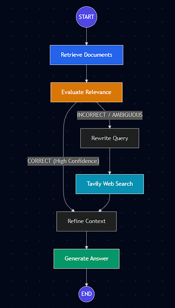
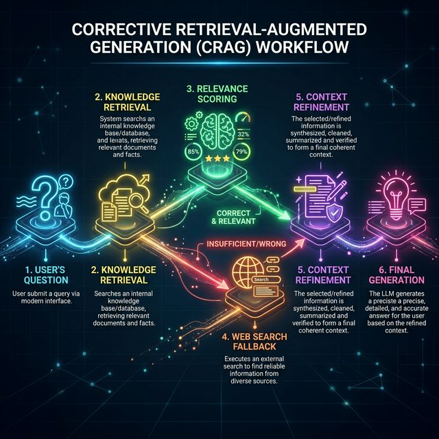
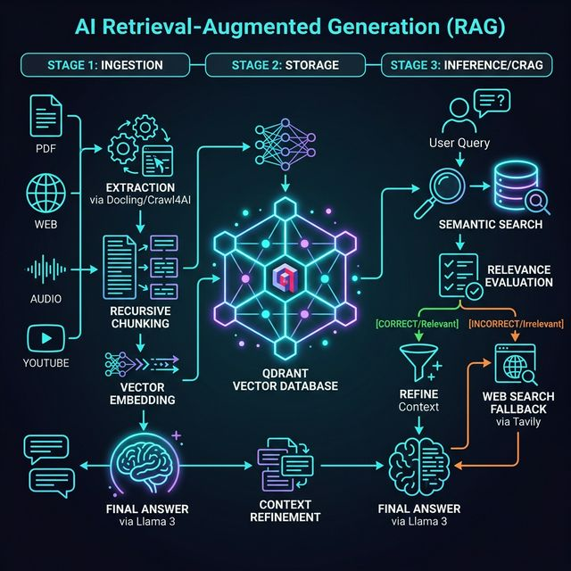

# 🧠 CRAG Pipeline — Corrective Retrieval-Augmented Generation

<div align="center">


[](https://www.python.org/)
[](https://fastapi.tiangolo.com/)
[](https://react.dev/)
[](https://github.com/langchain-ai/langgraph)
[](https://qdrant.tech/)
[](./LICENSE)

**An end-to-end Corrective RAG system that self-evaluates retrieved documents, falls back to live web search when needed, and visualizes the entire pipeline execution in real-time.**

[Features](#-features) • [Architecture](#-architecture) • [Tech Stack](#-tech-stack) • [Setup](#-setup) • [API Reference](#-api-reference) • [Screenshots](#-screenshots)

</div>

---

## 📖 What is CRAG?

Standard RAG systems blindly include retrieved documents in the prompt regardless of their relevance. **Corrective RAG (CRAG)** adds an intelligent self-correction layer:

1. **Retrieve** documents from a vector store.
2. **Evaluate** each document for relevance against the query using an LLM judge.
3. **Route** based on verdict:
   - ✅ **CORRECT** → Refine and generate directly from local documents.
   - ❌ **INCORRECT** → Rewrite the query and perform a live web search.
   - ⚠️ **AMBIGUOUS** → Merge local + web results before refining.
4. **Refine** context at the sentence level — only keeping sentences that directly answer the question.
5. **Generate** a grounded, faithful final answer.

This approach significantly reduces hallucination and ensures answers are always backed by relevant, high-quality context.

---

## ✨ Features

### 🔁 Corrective Pipeline
- **Adaptive routing** between local knowledge base and live web search (via Tavily)
- **Document-level scoring** with configurable upper (0.7) and lower (0.3) thresholds
- **Sentence-level context refinement** — strips noise, keeps only relevant sentences
- **Query rewriting** for optimized web search when local docs are insufficient

### 📥 Multi-Source Document Ingestion
| Source Type | Description |
|---|---|
| 📄 PDF (standard) | Extracted via `pymupdf4llm` to clean Markdown |
| 🔍 PDF (OCR/scanned) | Processed with `docling` for scanned documents |
| 📝 Plain Text (.txt) | Direct text read |
| 🎙️ Audio files | Transcribed via Groq Whisper-large-v3 |
| 🌐 Web pages | Rendered via Playwright + cleaned with BeautifulSoup |
| 🎥 YouTube videos | Transcript fetched via `youtube-transcript-api` |

### 🗺️ Interactive Graph Visualization
- Full **LangGraph pipeline topology** rendered in the browser using React Flow (`@xyflow/react`)
- **Live node status animation** — nodes light up as RUNNING → COMPLETED during query execution
- **Per-node state inspector** — click any node to view its exact input/output state from the last run
- **Path highlighting** — different visual paths for CORRECT vs INCORRECT/AMBIGUOUS routes

### 💬 Query Panel
- Real-time Q&A against ingested documents
- Displays answer **verdict** (CORRECT / INCORRECT / AMBIGUOUS) and reasoning
- Shows pipeline metadata: docs retrieved, docs kept, web query used
- **Query history** persisted in SQLite (last 20 queries)

### 🏗️ Production-Quality Backend
- **FastAPI** with full CORS support
- Persistent **Qdrant** vector store (local on-disk, no Docker needed)
- **Singleton pattern** for embedding model and graph — loaded once, reused
- Full async support with Windows `ProactorEventLoop` compatibility

---

## 🏛️ Architecture

### Pipeline Flow

```
User Question
      │
      ▼
 ┌─────────────┐
 │   Retrieve  │  ←── Qdrant vector DB (all-MiniLM-L6-v2 embeddings)
 └──────┬──────┘
        │
        ▼
 ┌──────────────────┐
 │  Eval Each Doc   │  ←── LLM (Llama 3.3 70B) scores each chunk [0.0 – 1.0]
 └──────┬───────────┘
        │
   ┌────┴────────────────┐
   │                     │
   ▼ CORRECT             ▼ INCORRECT / AMBIGUOUS
 ┌────────┐        ┌──────────────────┐
 │ Refine │        │  Rewrite Query   │
 └────┬───┘        └────────┬─────────┘
      │                     │
      │            ┌────────▼─────────┐
      │            │   Web Search     │  ←── Tavily API
      │            └────────┬─────────┘
      │                     │
      │            ┌────────▼─────────┐
      └───────────►│     Refine       │  ←── Sentence-level LLM filter
                   └────────┬─────────┘
                            │
                   ┌────────▼─────────┐
                   │    Generate      │  ←── Final answer with Llama 3.3 70B
                   └──────────────────┘
```

### System Architecture

```
┌─────────────────────────────────────────────────────────┐
│                    React Frontend                        │
│  ┌──────────────┐  ┌─────────────────┐  ┌────────────┐ │
│  │ UploadPanel  │  │  GraphViewer    │  │ QueryPanel │ │
│  │              │  │  (React Flow)   │  │            │ │
│  └──────┬───────┘  └────────┬────────┘  └─────┬──────┘ │
└─────────┼───────────────────┼─────────────────┼────────┘
          │     HTTP / Vite Proxy  │             │
┌─────────┼───────────────────┼─────────────────┼────────┐
│         ▼       FastAPI      ▼                 ▼        │
│  POST /ingest    GET /graph/nodes,edges  POST /query    │
│  GET  /history   GET /node/{id}/state                   │
│                                                         │
│  ┌──────────────────────────────────────────────────┐  │
│  │              CRAG Graph (LangGraph)               │  │
│  │  retrieve → eval → route → [web] → refine → gen  │  │
│  └──────────────────────────────────────────────────┘  │
│                                                         │
│  ┌──────────────┐  ┌───────────────┐  ┌─────────────┐  │
│  │ Qdrant (local│  │ all-MiniLM-L6 │  │ SQLite hist │  │
│  │  .qdrant_data│  │   embeddings  │  │    .db      │  │
│  └──────────────┘  └───────────────┘  └─────────────┘  │
└─────────────────────────────────────────────────────────┘
```

### LangGraph Node Topology



---

## 🛠️ Tech Stack

### Backend
| Component | Technology |
|---|---|
| API Framework | FastAPI + Uvicorn |
| Agentic Graph | LangGraph (StateGraph) |
| LLM | Groq — `llama-3.3-70b-versatile` |
| Embeddings | `sentence-transformers/all-MiniLM-L6-v2` |
| Vector Store | Qdrant (persistent local storage) |
| Web Search | Tavily API |
| Audio Transcription | Groq Whisper (`whisper-large-v3`) |
| PDF Extraction | `pymupdf4llm` (standard), `docling` (OCR) |
| Web Scraping | Playwright + BeautifulSoup4 |
| YouTube Transcripts | `youtube-transcript-api` |
| History Storage | SQLite3 |

### Frontend
| Component | Technology |
|---|---|
| Framework | React 19 + Vite 7 |
| Graph Visualization | `@xyflow/react` (React Flow) |
| Styling | Tailwind CSS v4 |
| Icons | Lucide React |
| HTTP Client | Axios |

---

## 🚀 Setup

### Prerequisites
- Python 3.10+
- Node.js 18+
- API keys for [Groq](https://console.groq.com/) and [Tavily](https://tavily.com/)

### 1. Clone the Repository

```bash
git clone https://github.com/your-username/C_RAG.git
cd C_RAG
```

### 2. Backend Setup

```bash
cd backend

# Create and activate virtual environment
python -m venv venv

# Windows
venv\Scripts\activate

# macOS/Linux
source venv/bin/activate

# Install dependencies
pip install -r requirements.txt
```

#### Configure Environment Variables

Create a `.env` file in the `backend/` directory:

```env
GROQ_API_KEY=your_groq_api_key_here
TAVILY_API_KEY=your_tavily_api_key_here
```

#### Start the Backend Server

```bash
uvicorn main:app --reload
```

The API will be available at `http://127.0.0.1:8000`  
Interactive docs at `http://127.0.0.1:8000/docs`

### 3. Frontend Setup

```bash
cd frontend

# Install dependencies
npm install

# Start the dev server
npm run dev
```

The React app will be available at `http://localhost:5173`

> **Note:** The Vite dev server proxies all API calls through to the FastAPI backend. Make sure the backend is running before querying.

---

## 📁 Project Structure

```
C_RAG/
├── assets/                        # Screenshots and diagrams
│   ├── hero.png
│   ├── workflow.png
│   ├── Agent_nodes.png
│   └── internal_workflow.png
│
├── backend/
│   ├── main.py                    # FastAPI app entrypoint
│   ├── requirements.txt
│   ├── .env                       # API keys (not committed)
│   │
│   ├── api/                       # Route handlers
│   │   ├── ingest.py              # POST /ingest
│   │   ├── query.py               # POST /query, GET /history
│   │   └── graph.py               # GET /graph/nodes|edges, GET /node/{id}/state
│   │
│   ├── graph/
│   │   └── crag_graph.py          # Core CRAG LangGraph pipeline
│   │
│   ├── services/
│   │   ├── embedding.py           # SentenceTransformer singleton
│   │   ├── vectorstore.py         # Qdrant client + CRUD operations
│   │   ├── preprocessing.py       # Text → clean Markdown
│   │   ├── chunking.py            # Recursive text splitter
│   │   └── history.py             # SQLite query history
│   │
│   ├── utils/
│   │   ├── file_loader.py         # PDF / TXT / Audio extractors
│   │   └── web_loader.py          # Webpage / YouTube extractors
│   │
│   ├── document_ingestion/
│   │   ├── extractors.py          # Playwright-based async web extractor
│   │   └── utils.py               # Ingestion helper utilities
│   │
│   ├── schemas/                   # Pydantic request/response models
│   ├── core/                      # App config
│   ├── data/                      # SQLite DB (auto-created)
│   └── .qdrant_data/              # Qdrant persistent storage (auto-created)
│
└── frontend/
    ├── index.html
    ├── vite.config.js             # Vite config with API proxy
    ├── package.json
    └── src/
        ├── App.jsx
        ├── main.jsx
        ├── index.css              # Global styles + design tokens
        ├── pages/
        │   └── Dashboard.jsx      # Main 3-column layout
        ├── components/
        │   ├── UploadPanel.jsx    # Document ingestion UI
        │   ├── QueryPanel.jsx     # Q&A + history UI
        │   ├── GraphViewer.jsx    # React Flow CRAG graph
        │   └── NodeTooltip.jsx    # Node state inspector tooltip
        └── services/              # API call wrappers
```

---

## 📡 API Reference

### `POST /ingest`

Ingest a document by file upload or URL into the vector store.

**Form Parameters:**
| Field | Type | Description |
|---|---|---|
| `file` | `UploadFile` | File to upload (PDF, TXT, MP3, WAV, etc.) |
| `url` | `string` | URL to scrape (webpage or YouTube link) |
| `source_type` | `string` | One of: `simple_pdf`, `ocr_pdf`, `txt`, `audio`, `website`, `youtube` |

**Response:**
```json
{
  "status": "success",
  "message": "Ingested and stored 42 chunks.",
  "num_chunks": 42
}
```

---

### `POST /query`

Run the CRAG pipeline on a question.

**Request Body:**
```json
{
  "question": "What is Corrective RAG?"
}
```

**Response:**
```json
{
  "answer": "Corrective RAG is an approach that...",
  "verdict": "CORRECT",
  "reason": "At least one retrieved chunk scored > 0.7.",
  "web_query": "",
  "num_good_docs": 3,
  "num_kept_strips": 8
}
```

---

### `GET /history`

Returns the last 20 queries and answers from SQLite.

---

### `GET /graph/nodes`

Returns the graph node list for frontend visualization.

### `GET /graph/edges`

Returns the graph edge list including conditional routing info.

### `GET /node/{node_id}/state`

Returns the `input_state` and `output_state` of a specific node from the **most recent** pipeline run.

Valid node IDs: `retrieve`, `eval_each_doc`, `rewrite_query`, `web_search`, `refine`, `generate`

---

## 🖼️ Screenshots

### Application Workflow


### Knowledge Ingestion


### Internal Pipeline Flow


---

## ⚙️ CRAG Configuration

Key thresholds and limits are defined at the top of `backend/graph/crag_graph.py`:

```python
RET_LIMIT   = 3     # Number of documents retrieved from vector store
TAVILY_LIMIT = 1    # Number of web search results fetched
UPPER_TH    = 0.7   # Score above this → CORRECT verdict
LOWER_TH    = 0.3   # Score below this → INCORRECT verdict
                    # Between thresholds → AMBIGUOUS (uses both sources)
```

---

## 🧩 How the Pipeline Works — Step by Step

### Step 1: Ingestion Pipeline
```
File/URL Input
    → Extract raw text (PDF/TXT/Audio/Web/YouTube)
    → Preprocess to clean Markdown
    → Chunk with RecursiveTextSplitter
    → Encode with all-MiniLM-L6-v2
    → Upsert into Qdrant (persistent local DB)
```

### Step 2: Query Pipeline
```
User Question
    → Encode query vector (all-MiniLM-L6-v2)
    → Retrieve top-3 chunks from Qdrant (cosine similarity)
    → LLM scores each chunk [0.0 → 1.0]
    → Verdict decision:
        • CORRECT  (any score > 0.7) → skip web search
        • INCORRECT (all scores < 0.3) → web search only
        • AMBIGUOUS  (mixed scores) → both sources
    → [If needed] Rewrite query → Tavily web search
    → Decompose context into sentences
    → LLM filters each sentence (keep/drop)
    → Generate final answer from refined context
```

---

## 🔑 Key Design Decisions

| Decision | Reasoning |
|---|---|
| **LangGraph StateGraph** | Provides explicit, inspectable pipeline state at each node — enabling the graph visualization feature |
| **Singleton graph + model** | Avoid re-initializing the 80M+ parameter model on every request |
| **Sentence-level filtering** | Eliminates noise within "good" documents, not just bad documents |
| **Qdrant on-disk** | Persistent between server restarts without requiring a separate Docker service |
| **Groq Whisper for audio** | Fast, accurate transcription via API — no local GPU required |
| **Playwright for web scraping** | Handles JS-rendered pages and bot protection that `requests` cannot |
| **SQLite for history** | Zero-dependency, file-based persistence for query logs |

---

## 🤝 Contributing

Pull requests are welcome. For major changes, please open an issue first to discuss what you would like to change.

---

## 📄 License

This project is licensed under the MIT License.

---

<div align="center">

Built with ❤️ using LangGraph, FastAPI, and React

</div>
